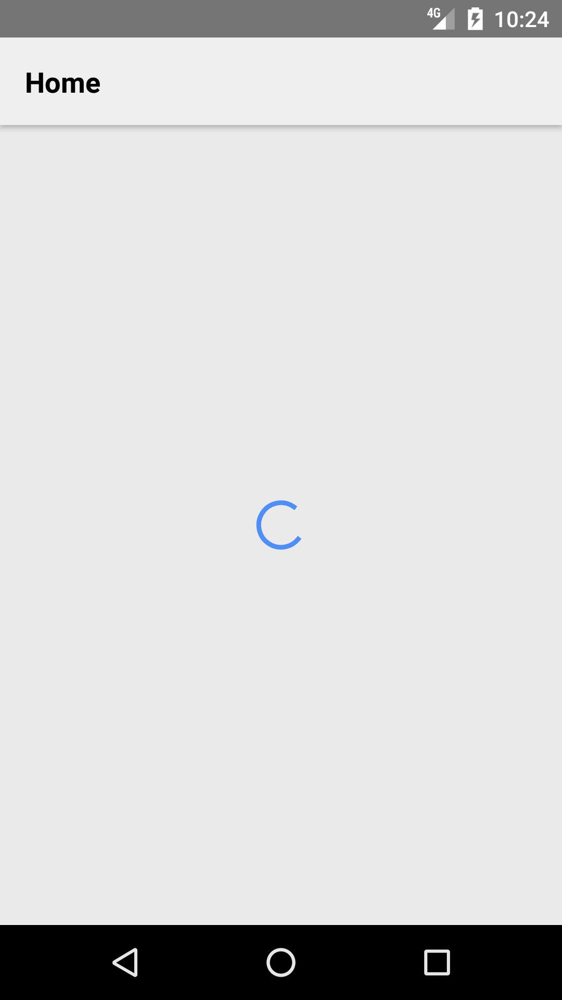
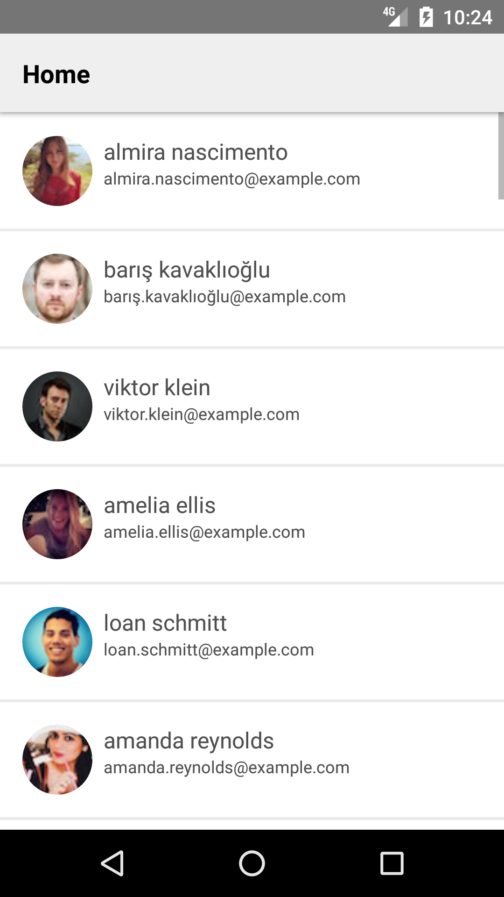

# React Native Fetch

#### *Starter Template* for *React-Native* using *Redux Architecture*  that maps *json* data acquired using *fetch()*.

### Screenshots

### Packages
- **redux**
- **react-redux**
- **redux-thunk**
- **react-navigation**
- **react-native-vector-icons**

## Installation
1. Initialize node modules with **npm install** or **yarn install**.
2. Create an instance of react-native packager by **react-native start**.
3. Make sure a device is connected.
4. Execute **react-native run-android** for android or **react-native run-ios** for iOS.

## License

 Copyright 2017 Jerameel M. Delos Reyes

   Licensed under the Apache License, Version 2.0 (the "License");
   you may not use this file except in compliance with the License.
   You may obtain a copy of the License at

       http://www.apache.org/licenses/LICENSE-2.0

   Unless required by applicable law or agreed to in writing, software
   distributed under the License is distributed on an "AS IS" BASIS,
   WITHOUT WARRANTIES OR CONDITIONS OF ANY KIND, either express or implied.
   See the License for the specific language governing permissions and
limitations under the License.
